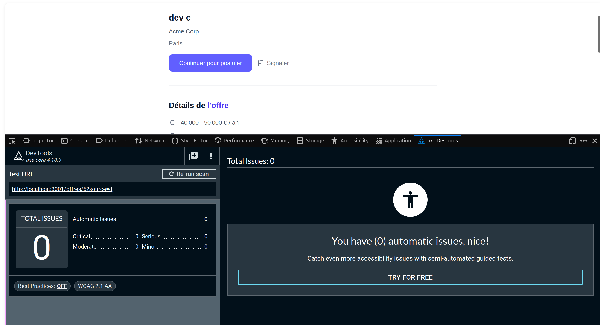

# Accessibility Audit — WCAG 2.1 Level AA

## Tool Used

axe DevTools v4.10.3 — Firefox/Chrome browser extension

## Audited Page

URL: http://localhost:3000/offres/[id]
Date: 21/05/2026

---

## Audit Results

### 7 issues detected

| #   | Rule                                                       | Impact   | Element                                                                                   | Detail                                                                                  |
| --- | ---------------------------------------------------------- | -------- | ----------------------------------------------------------------------------------------- | --------------------------------------------------------------------------------------- |
| 1   | Elements must meet minimum color contrast ratio thresholds | Serious  | `<span class="bg-indigo-500 text-white">React</span>`                                     | Insufficient contrast: 3.04 (expected: 4.5:1). Color `#ffffff` on background `#6366f1`  |
| 2   | Elements must meet minimum color contrast ratio thresholds | Serious  | `<span class="bg-indigo-500 text-white">Node.js</span>`                                   | Insufficient contrast: 3.04 (expected: 4.5:1). Color `#ffffff` on background `#6366f1`  |
| 3   | Elements must meet minimum color contrast ratio thresholds | Serious  | `<p class="text-sm text-gray-400">Chargement de l'offre...</p>`                           | Insufficient contrast: 2.49 (expected: 4.5:1). Color `#99a1af` on background `#ffffff`  |
| 4   | Elements must meet minimum color contrast ratio thresholds | Serious  | `<p class="text-sm text-gray-400">Chargement...</p>` (Suspense fallback)                  | Insufficient contrast: 2.49 (expected: 4.5:1). Color `#99a1af` on background `#ffffff`  |
| 5   | Elements must meet minimum color contrast ratio thresholds | Serious  | `<textarea placeholder="Raison du signalement (optionnel)" class="placeholder-gray-400">` | Insufficient contrast: 2.49 (expected: 4.5:1). Color `#99a1af` on background `#ffffff`  |
| 6   | Form elements must have labels                             | Critical | `<textarea class="... placeholder-gray-400 ...">`                                         | Textarea in report modal has no associated `<label>`, `aria-label` or `aria-labelledby` |
| 7   | ARIA dialog role must have an accessible name              | Serious  | `<div class="fixed inset-0 z-50 ...">`                                                    | Modal overlay has no `role="dialog"`, `aria-modal` or `aria-labelledby`                 |

---

## Fixes Applied

### Fix 1, 2 — Skill tag contrast in OffreDetail

```tsx
// Before
className =
  "text-xs bg-indigo-500 text-white px-2.5 py-1 rounded-md font-medium";

// After
className =
  "text-xs bg-indigo-700 text-white px-2.5 py-1 rounded-md font-medium";
```

Applied to all skill tags rendered by `parsedSkills()`.

### Fix 3 — Loading state text contrast

```tsx
// Before
<p className="text-center py-20 text-sm text-gray-400">
  Chargement de l'offre...
</p>

// After
<p className="text-center py-20 text-sm text-gray-500">
  Chargement de l'offre...
</p>
```

### Fix 4 — Suspense fallback text contrast

```tsx
// Before
<p className="text-center py-20 text-sm text-gray-400">
  Chargement...
</p>

// After
<p className="text-center py-20 text-sm text-gray-500">
  Chargement...
</p>
```

### Fix 5 — Textarea placeholder contrast in report modal

```tsx
// Before
className = "... placeholder-gray-400 ...";

// After
className = "... placeholder-gray-500 ...";
```

### Fix 6 — Textarea missing accessible label in report modal

```tsx
// Before
<textarea
  value={reportReason}
  onChange={(e) => setReportReason(e.target.value)}
  placeholder="Raison du signalement (optionnel)"
  className="..."
/>

// After
<label htmlFor="report-reason" className="sr-only">
  Raison du signalement
</label>
<textarea
  id="report-reason"
  value={reportReason}
  onChange={(e) => setReportReason(e.target.value)}
  placeholder="Raison du signalement (optionnel)"
  className="..."
/>
```

### Fix 7 — Report modal missing ARIA dialog attributes

```tsx
// Before
<div className="fixed inset-0 z-50 flex items-center justify-center bg-black/40 px-4">
  <div className="bg-white rounded-xl shadow-lg max-w-md w-full p-6 flex flex-col gap-4">
    <h3 ...>Signaler cette offre</h3>

// After
<div
  role="dialog"
  aria-modal="true"
  aria-labelledby="report-modal-title"
  className="fixed inset-0 z-50 flex items-center justify-center bg-black/40 px-4"
>
  <div className="bg-white rounded-xl shadow-lg max-w-md w-full p-6 flex flex-col gap-4">
    <h3 id="report-modal-title" ...>Signaler cette offre</h3>
```

---

## Final Result

**0 issues** after fixes — WCAG 2.1 Level AA validated on the Job Offer Detail flow.

## Summary of Fixes

| Issue                                | Before                 | After                                     |
| ------------------------------------ | ---------------------- | ----------------------------------------- |
| Skill tag contrast too low           | `bg-indigo-500`        | `bg-indigo-700`                           |
| Loading text too light               | `text-gray-400`        | `text-gray-500`                           |
| Suspense fallback text too light     | `text-gray-400`        | `text-gray-500`                           |
| Textarea placeholder too light       | `placeholder-gray-400` | `placeholder-gray-500`                    |
| Textarea missing accessible label    | No `label` association | `htmlFor` + `id` added                    |
| Modal missing ARIA dialog attributes | No `role` or `aria-*`  | `role="dialog"` + `aria-labelledby` added |

### Screen


