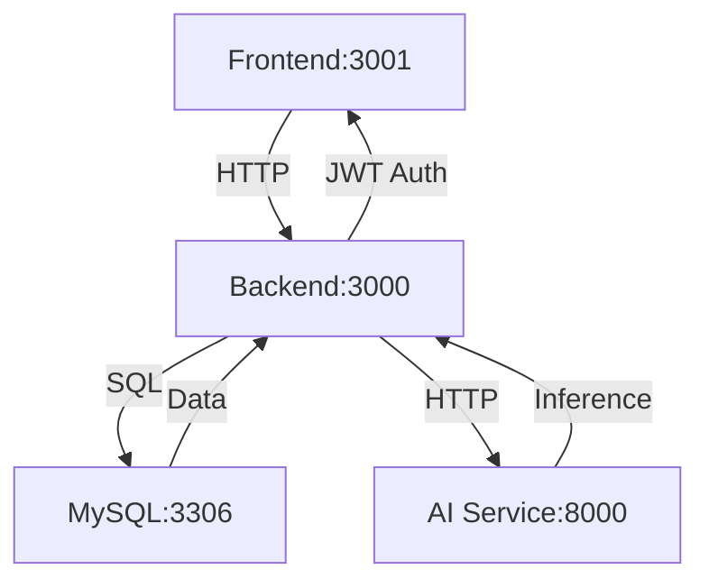

# Architecture Decision Record (ADR): Full-Stack Architecture & Service Boundaries

## Status

Accepted

## Context

The DevJobs platform must aggregate external job offers (WeLoveDevs), allow recruiters to post listings, and provide AI-powered insights — all while maintaining fast response times, scalability, and developer productivity. The system must support two distinct user experiences (job seekers and recruiters) with a unified data backend.

We needed an architecture that:
- Handles real-time job aggregation and user interactions
- Supports AI inference without external API dependencies
- Maintains clear separation of concerns
- Enables independent deployment and scaling of components
- Provides a responsive, accessible frontend experience

## Decision

We choose a **multi-container microservices architecture** with:
- **Frontend**: Next.js 16 (React 19) with TypeScript
- **Backend**: Express.js 4 (Node.js 20) REST API
- **Database**: MySQL 8.0 relational database
- **AI Service**: FastAPI (Python 3.9) with local LLM inference

All services communicate via a dedicated Docker bridge network (`backend_network`) and are orchestrated using Docker Compose.

## Why (Rationale)

### 1. Service-Oriented Architecture

**Why:** A monolithic application would tightly couple frontend, backend, and AI logic, making it difficult to scale components independently and increasing deployment risk. Separating concerns into distinct services allows:
- Independent scaling (e.g., AI service can scale separately from API)
- Technology specialization (Node.js for API, Python for AI)
- Clear ownership boundaries
- Faster iteration on individual components

### 2. Next.js for Frontend

**Why:** Next.js provides:
- **App Router** for modern routing and data fetching
- **TypeScript support** for type safety
- **Tailwind CSS** integration for rapid UI development
- **Standalone output** for optimized production builds
- **Radix UI** primitives for accessible components
- **SEO-friendly** server-side rendering capabilities

### 3. Express.js for Backend

**Why:** Express.js offers:
- **Lightweight** and fast HTTP server
- **Mature ecosystem** with middleware support
- **Easy integration** with MySQL and JWT authentication
- **Flexible routing** for REST API endpoints
- **Widespread adoption** with extensive community support

### 4. MySQL for Database

**Why:** MySQL provides:
- **Relational integrity** with foreign keys and constraints
- **ACID compliance** for transactional safety
- **JSON support** for flexible data structures (skills, AI tags)
- **Widespread hosting** support and tooling
- **Performance** for read-heavy workloads (job listings)

### 5. FastAPI for AI Service

**Why:** FastAPI enables:
- **High-performance** Python API for AI inference
- **Automatic OpenAPI documentation**
- **Async support** for concurrent requests
- **Easy integration** with llama-cpp-python
- **Type hints** for better code maintainability

### 6. Docker Compose Orchestration

**Why:** Docker Compose provides:
- **Simple multi-container** application definition
- **Isolated environments** for development and production
- **Service discovery** via container names
- **Volume persistence** for database data
- **Health checks** for dependent services

## How (Implementation)

### Service Architecture Diagram



### Port Allocation

- **Frontend**: Port 3001 (Next.js development server)
- **Backend**: Port 3000 (Express.js API)
- **Database**: Port 3306 (MySQL)
- **AI Service**: Port 8000 (FastAPI)

### Communication Flow

1. **Frontend → Backend**: REST API calls with JWT authentication
2. **Backend → Database**: Parameterized SQL queries via mysql2
3. **Backend → AI Service**: HTTP POST requests for summarization/analysis
4. **AI Service → Backend**: JSON responses with AI-generated content

### Docker Network Configuration

All services share a dedicated bridge network (`backend_network`) for secure internal communication:

```yaml
networks:
  backend_network:
    driver: bridge
```

### Service Boundaries

| Service | Responsibility | Technology Stack |
|---------|---------------|------------------|
| Frontend | User interface, routing, state management | Next.js 16, React 19, TypeScript, Tailwind CSS, Radix UI |
| Backend | API endpoints, authentication, business logic | Express.js 4, Node.js 20, JWT, bcryptjs |
| Database | Data persistence, relationships, queries | MySQL 8.0, mysql2 driver |
| AI Service | LLM inference, summarization, analysis | FastAPI, Python 3.9, llama-cpp-python |

## Trade-offs

### Pros

- **Independent Scaling**: Each service can scale independently based on demand
- **Technology Specialization**: Use the best tool for each job (Node.js for API, Python for AI)
- **Clear Ownership**: Well-defined boundaries between components
- **Resilience**: Failure in one service doesn't necessarily bring down others
- **Developer Productivity**: Teams can work on different services simultaneously

### Cons & Limitations

- **Operational Complexity**: Multiple containers to manage and monitor
- **Network Overhead**: Inter-service communication adds latency
- **Deployment Coordination**: Requires orchestration for multi-service deployments
- **Debugging Complexity**: Distributed tracing needed for cross-service issues
- **Resource Overhead**: Multiple containers consume more memory than monolithic

## Rejected Alternatives

### 1. Monolithic Architecture (Rejected)

**Why Rejected:** A single monolithic application would:
- Couple frontend, backend, and AI logic tightly
- Make independent scaling impossible
- Increase deployment risk (one change affects entire system)
- Reduce technology flexibility
- Complicate continuous deployment

### 2. Server-Side Rendering Framework (Rejected)

**Why Rejected:** Frameworks like Django or Ruby on Rails would:
- Limit frontend interactivity and real-time updates
- Reduce developer productivity for modern UI requirements
- Make it harder to implement complex client-side state management
- Lack the rich ecosystem of React/Next.js components

### 3. NoSQL Database (Rejected)

**Why Rejected:** MongoDB or similar would:
- Lack relational integrity for job-company relationships
- Make complex queries (filtering, sorting) more difficult
- Require additional application logic for joins
- Not provide ACID transactions for critical operations

### 4. Cloud-Hosted AI API (Rejected)

**Why Rejected:** External AI APIs would:
- Violate project requirement for local, offline AI
- Introduce privacy concerns with user data
- Add ongoing operational costs
- Create dependency on third-party availability
- Make it impossible to guarantee <5s response times

## Linked Evidence

- **Frontend Implementation**: `/Front/src/` directory
- **Backend Implementation**: `/Backend/server.js`, `/Backend/app.js`
- **Database Schema**: `/Backend/config/db.js`, `/Backend/config/init.sql`
- **AI Service**: `/AI-service/main.py`
- **Docker Configuration**: `docker-compose.yml`
- **Service Communication**: Network requests in controllers and services
- **Port Configuration**: Environment variables and docker-compose.yml

## References

- Next.js Documentation: https://nextjs.org/docs
- Express.js Documentation: https://expressjs.com/
- MySQL Documentation: https://dev.mysql.com/doc/
- FastAPI Documentation: https://fastapi.tiangolo.com/
- Docker Compose Documentation: https://docs.docker.com/compose/ 