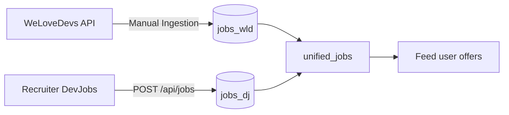

# ADR-PRODUCT: DevJobs Platform Product Decisions

**Date:** 05/13/2026
**Status:** Accepted

---

## Context

The project involves building a developer-centric job board by aggregating external offers (WeLoveDevs) and allowing recruiters to post their own listings. The platform must address two types of users with very different needs: junior developers looking for work, and recruiters seeking to reach this audience.

Existing platforms (LinkedIn, Indeed) are generalist and ill-suited for junior developers: complex interfaces, "junior" offers requiring 2+ years of experience, and heavy application processes.

---

## Why

### Target Users

**Lucas** - Junior Developer (21 years old, finishing training)

- Lost on generalist platforms
- Wants honest offers tailored to his level
- Seeks a simple and fast application process

**Sarah** - Startup Founder (34 years old)

- No dedicated HR department
- Wants to reach motivated tech profiles
- Seeks to post offers quickly and track applications

Without a dedicated space for each role, the platform cannot effectively meet the needs of these two personas with opposing expectations.

---

## How

### Decision 1: Two Distinct Spaces

The platform is divided into two separate experiences based on the user role:

**Job Seeker Space (Lucas)**

- Aggregated job feed (WeLoveDevs + DevJobs offers)
- Save offers to view later
- One-click application from the job detail page
- Application dashboard with tracking

**Recruiter Space (Sarah)**

- Post job offers directly on the platform
- Dashboard for jobs posted by the company
- Consultation of applications received per offer

### Decision 2: WeLoveDevs Job Aggregation

WeLoveDevs offers are ingested via their official API and stored in the local database (`jobs_wld`). Offers posted directly by recruiters are stored in `jobs_dj`. A unified view (`unified_jobs`) exposes both sources to the frontend.

### Decision 3: Application System

A user can apply to any offer (WeLoveDevs or DevJobs) from the job listing. The application is recorded in the `applications` table with the source (`wld` or `dj`) to allow differentiated tracking.

**Routes:**

- `POST /api/applications` - apply
- `GET /api/applications` - list of my applications
- `GET /api/applications/:id` - application details

### Decision 4: Saving Jobs

Users can save offers to view them later without applying immediately. This system reduces friction in the user journey by separating the discovery phase from the application phase.

**Routes:**

- `POST /api/saved-jobs` - save a job
- `DELETE /api/saved-jobs/:id` - remove a saved job
- `GET /api/saved-jobs` - list of saved jobs

---

## Trade-offs

| Decision               | Advantage                                | Disadvantage                                       |
| :--------------------- | :--------------------------------------- | :------------------------------------------------- |
| Two distinct spaces    | Experience tailored to each role         | More pages to develop and maintain                 |
| WeLoveDevs aggregation | Immediate content without posting effort | Dependency on an external API, read-only data      |
| Database applications  | Recruiter-side tracking possible         | Requires authentication, no anonymous applications |
| Job saving             | Reduces application friction             | Additional data to store per user                  |

---

## Rejected Alternatives

### Generalist Platform (All Sectors)

**Why rejected:** Generalist platforms (Indeed, LinkedIn) suffer from an excess of irrelevant offers for developers. Specializing in tech profiles allows for better job targeting and builds a consistent community.

### Application via Email Only

**Why rejected:** An email-only application system does not allow for centralized tracking or a dashboard for the recruiter. The product value lies in the ability to track and manage applications directly from the platform.

---

## References

- Personas: `Docs/persona.md`
- Competitive Analysis: `Docs/recruitment-space.md`
- Database Schema: `Docs/init.md`
- Application Routes: `Backend/routes/candidatureRoutes.js`
- Job Routes: `Backend/routes/jobRoutes.js`
- Saving Routes: `Backend/routes/savedJobRoutes.js`
